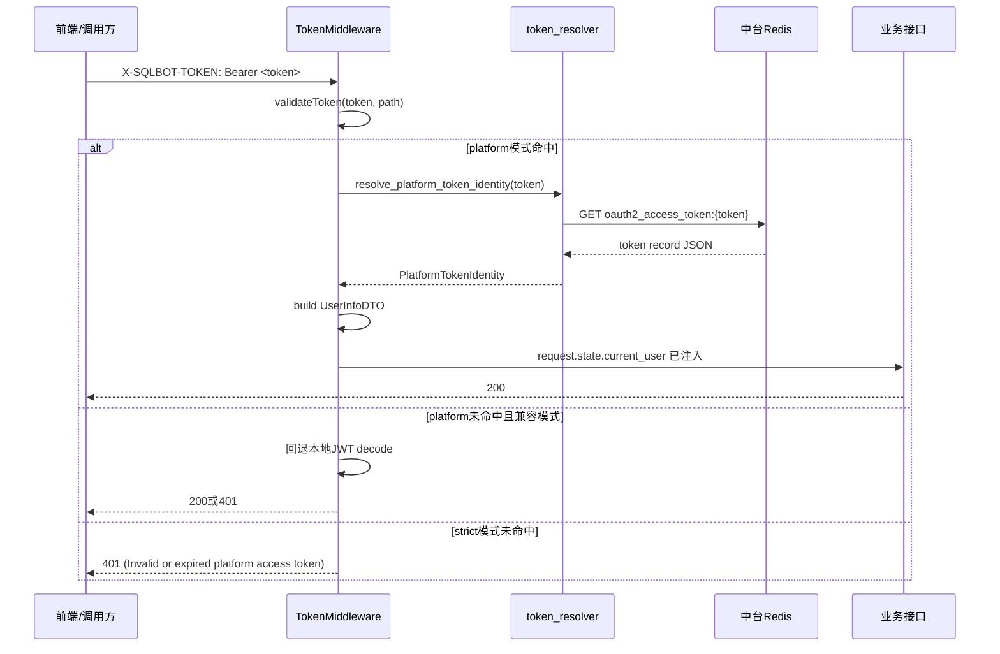

# Token中间件 Redis用户恢复完整开发指南（SQLBot-cx）

本文档用于解释 SQLBot 如何改造 Token 认证中间件，实现“从数据中台 Redis 恢复用户信息并写入请求上下文”。

适用代码仓库：`/mnt/h/light/project/SQLBot-cx`

---

## 1. 目标与背景

### 1.1 业务目标

将 SQLBot 的认证方式从“只认本地 JWT”扩展为“可识别数据中台 access_token（Redis存储）”，让 SQLBot 可以接入中台统一认证体系。

### 1.2 改造前的问题

原始逻辑是：

1. 从请求头取 `X-SQLBOT-TOKEN`。
2. 直接 `jwt.decode(...)`。
3. 用 JWT 中的 `id` 查 SQLBot 本地用户。

这对中台 token 不成立：

1. 中台 token 通常是随机串，不是 JWT 三段式。
2. 直接 JWT 解码会报 `Not enough segments`。

### 1.3 改造后能力

新增一条认证路径：

1. 从 Header 取 Bearer token。
2. 按 key `oauth2_access_token:{token}` 查 Redis。
3. 解析 token 记录，提取 `userId/account/tenantId`。
4. 构建 SQLBot 的 `UserInfoDTO`。
5. 写入 `request.state.current_user`。

---

## 2. 涉及文件总览

### 2.1 核心后端文件

1. `backend/common/core/token_resolver.py`
- 负责 Redis token 解析（新增核心）。

2. `backend/apps/system/middleware/auth.py`
- Token 中间件入口。
- 决定走 Redis token 还是本地 JWT。

3. `backend/common/core/config.py`
- 平台认证配置项。

4. `backend/apps/system/api/login.py`
- strict 模式下禁用本地登录。

### 2.2 关键前端关联（联调视角）

1. `frontend/src/utils/request.ts`
- 把 `user.token` 注入为 `X-SQLBOT-TOKEN: Bearer ...`。

2. `frontend/src/router/watch.ts`
- 路由守卫判断有无 token。
- 首次进入时请求 `/user/info` 恢复用户。

3. `frontend/src/stores/user.ts`
- 管理 token 与用户信息状态。

---

## 3. Redis token 数据结构与字段映射

你当前中台 Redis 里 token 示例（简化）：

```json
{
  "tenantId": 124,
  "accessToken": "c4dd...",
  "userId": 132,
  "userType": 2,
  "userInfo": {
    "nickname": "八院",
    "username": "admin"
  },
  "expiresTime": 1774515475750
}
```

映射到 SQLBot `UserInfoDTO`：

1. `userId -> id`
2. `userInfo.username -> account`
3. `tenantId -> oid`
4. `userInfo.nickname -> name`

默认填充值：

1. `origin=1`
2. `language='zh-CN'`
3. `email='{account}@platform.local'`
4. `isAdmin=(account=='admin' 或 userId==1)`

---

## 4. 认证流程（请求时序）



---

## 5. `token_resolver.py` 逐函数解释

文件：`backend/common/core/token_resolver.py`

### 5.1 `PlatformTokenIdentity`

标准化后的平台身份对象，供中间件使用，避免在中间件里直接处理原始 JSON。

### 5.2 `_get_platform_auth_redis_client()`

功能：

1. 检查 `PLATFORM_AUTH_ENABLED`。
2. 获取 Redis URL（优先 `PLATFORM_AUTH_REDIS_URL`）。
3. 复用单例 Redis 客户端。

### 5.3 `_normalize_redis_key(access_token)`

功能：根据前缀拼接 Redis key。

默认前缀：`oauth2_access_token:%s`

### 5.4 `_parse_json_object(raw_value)`

功能：把 Redis 字符串解析成 `dict`。

兼容两种格式：

1. 普通 JSON 对象字符串。
2. 二次 JSON 编码字符串（外层字符串里再包一层 JSON）。

> 你之前遇到的“Redis key 存在但解析失败”就是这个点引发的。

### 5.5 `_parse_datetime(value)`

功能：解析 `expiresTime`，兼容：

1. ISO 时间字符串。
2. `yyyy-MM-dd HH:mm:ss`。
3. 秒级时间戳。
4. 毫秒时间戳（Java 常见）。

### 5.6 `_build_platform_identity(token_record)`

校验并构建身份对象：

1. 过期检查（`expiresTime`）。
2. 用户类型检查（`PLATFORM_AUTH_REQUIRE_USER_TYPE`）。
3. 提取 `userId / tenantId / account`。
4. 任一关键字段缺失则返回 `None`。

### 5.7 `resolve_platform_token_identity(access_token)`

对外入口：

1. 查 Redis。
2. 解析 JSON。
3. 返回 `PlatformTokenIdentity | None`。

---

## 6. `auth.py` 中间件逻辑详解

文件：`backend/apps/system/middleware/auth.py`

### 6.1 `dispatch()`

执行顺序：

1. OPTIONS/白名单直接放行。
2. 处理 ask-token / assistant-token。
3. 读取常规 token：
   - `settings.TOKEN_KEY`（默认 `X-SQLBOT-TOKEN`）
   - 可选回退 `Authorization`
4. 调用 `validateToken(...)`。
5. 成功则设置 `request.state.current_user`。

### 6.2 `validateToken()`

核心分支：

1. 如果开启 platform 模式：尝试 Redis 恢复用户。
2. 命中：直接通过。
3. strict 模式未命中：直接 401（不回退 JWT）。
4. 兼容模式未命中：回退本地 JWT 逻辑。

### 6.3 `_build_user_from_platform_token()`

将平台身份映射为 `UserInfoDTO`。

---

## 7. 配置项说明（`config.py`）

文件：`backend/common/core/config.py`

关键配置：

1. `PLATFORM_AUTH_ENABLED`
- 是否开启平台认证能力。

2. `PLATFORM_AUTH_REDIS_URL`
- 平台 Redis 地址。
- 示例：`redis://127.0.0.1:6379/1`

3. `PLATFORM_AUTH_REDIS_KEY_PREFIX`
- token key 前缀，默认 `oauth2_access_token:%s`。

4. `PLATFORM_AUTH_USERINFO_ACCOUNT_FIELD`
- 从 `userInfo` 取账号字段名，默认 `username`。

5. `PLATFORM_AUTH_REQUIRE_USER_TYPE`
- 可选，限制 userType。

6. `PLATFORM_AUTH_ACCEPT_AUTHORIZATION_HEADER`
- 是否支持 `Authorization: Bearer ...`。

7. `PLATFORM_AUTH_STRICT_MODE`
- true：仅认平台 Redis token；本地 JWT 禁用。
- false：平台失败时可回退本地 JWT。

---

## 8. 推荐运行模式

### 8.1 联调期（建议）

```env
PLATFORM_AUTH_ENABLED=true
PLATFORM_AUTH_STRICT_MODE=false
PLATFORM_AUTH_REDIS_URL=redis://127.0.0.1:6379/1
PLATFORM_AUTH_REDIS_KEY_PREFIX=oauth2_access_token:%s
PLATFORM_AUTH_USERINFO_ACCOUNT_FIELD=username
PLATFORM_AUTH_ACCEPT_AUTHORIZATION_HEADER=true
```

优点：排障阶段允许回退，便于比较新旧链路。

### 8.2 生产统一认证（建议）

```env
PLATFORM_AUTH_ENABLED=true
PLATFORM_AUTH_STRICT_MODE=true
PLATFORM_AUTH_REDIS_URL=redis://:<password>@<redis-host>:6379/1
PLATFORM_AUTH_REDIS_KEY_PREFIX=oauth2_access_token:%s
PLATFORM_AUTH_USERINFO_ACCOUNT_FIELD=username
PLATFORM_AUTH_ACCEPT_AUTHORIZATION_HEADER=true
```

效果：

1. 完全去除本地 JWT 作为主认证路径。
2. 本地 `/login/access-token` 会被禁用（403）。

---

## 9. 如何做最小联调测试

### 9.1 Redis连通与key检查

```bash
TOKEN='c4dd378b26714930842df61b9c38bf90'
redis-cli -h 127.0.0.1 -p 6379 -n 1 EXISTS "oauth2_access_token:${TOKEN}"
redis-cli -h 127.0.0.1 -p 6379 -n 1 GET "oauth2_access_token:${TOKEN}"
```

### 9.2 resolver自测（后端进程同环境）

```bash
python - <<'PY'
import asyncio
from common.core.token_resolver import resolve_platform_token_identity
async def main():
    print(await resolve_platform_token_identity("c4dd378b26714930842df61b9c38bf90"))
asyncio.run(main())
PY
```

期望：输出 `PlatformTokenIdentity(...)`。

### 9.3 接口验证

```bash
curl --noproxy '*' -i "http://127.0.0.1:8013/api/v1/user/info" \
  -H "X-SQLBOT-TOKEN: Bearer c4dd378b26714930842df61b9c38bf90"
```

期望：HTTP 200。

---

## 10. 常见问题与定位路径

### 10.1 报 `Miss Token[...]`

原因：请求头没带上或 curl 写法错误。

排查：

1. 用单行 curl 或确保反斜杠后无空格。
2. `-v` 看请求头是否包含 `X-SQLBOT-TOKEN`。

### 10.2 报 `Not enough segments`

原因：走到了 JWT decode，说明 Redis恢复失败并发生了回退。

排查：

1. `resolve_platform_token_identity` 是否返回 None。
2. Redis key 是否存在。
3. `expiresTime` 是否过期。
4. `PLATFORM_AUTH_ENABLED` 是否生效。

### 10.3 报 `Invalid or expired platform access token!`

原因：strict 模式下 Redis 未命中或解析失败。

排查：

1. token 是否拼写错误。
2. Redis DB 是否正确（0/1）。
3. key 前缀是否一致。

### 10.4 报 `ModuleNotFoundError: redis`

原因：运行 Python 环境未安装 redis 包，或 pip/python 不同环境。

修复：

```bash
python -m pip install redis
python - <<'PY'
import redis
from redis.asyncio import Redis
print(redis.__version__)
PY
```

---

## 11. 扩展建议（后续开发）

1. 增加结构化日志：
- 记录 token 命中状态、拒绝原因（避免打印完整token）。

2. 增加熔断/降级：
- Redis不可用时是否允许临时回退策略（需明确安全边界）。

3. 扩展用户映射：
- 将 `deptId/role/scopes` 映射到 `UserInfoDTO` 扩展字段。

4. 增加自动化测试：
- 正常 token
- 过期 token
- 双层 JSON token
- strict/compat 两模式

5. 前端增强：
- 支持 URL token 注入（新窗口直达）并自动清理地址栏。

---

## 12. 开发者快速记忆版

一句话：

SQLBot 中间件现在先把 Bearer token 当“中台 Redis key”去查，查到就恢复用户并放入 `request.state.current_user`，查不到再按模式决定是否回退本地 JWT。

你后续开发时，只要围绕这三个点看就不会乱：

1. token 从哪里取（header）
2. 用户从哪里恢复（Redis）
3. 用户注入到哪里（request.state.current_user）

