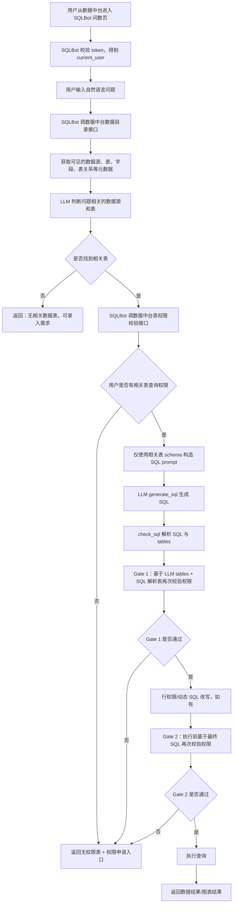

# SQLBot 数据目录与表权限改造建设方案

## 1. 背景与目标

本文用于沉淀 SQLBot 接入数据中台数据目录与表权限控制的建设方案。

当前共识是：

- 用户已经从数据中台进入 SQLBot 问数页面，token 登录校验链路独立完成。
- 数据中台规则是：用户可以看到数据源、表、字段等元数据信息；真正查询数据时才需要权限。
- SQLBot 需要基于数据中台提供的元数据完成问题理解、数据源选择、相关表识别与 SQL 生成。
- SQLBot 在执行 SQL 前必须调用数据中台校验用户是否拥有相关表的数据查询权限。
- 如果用户问题命中了相关表，但用户没有权限，需要返回相关表与权限申请入口，而不是简单提示找不到数据。

本方案目标：

1. 明确数据中台 `data` 模块需要提供的两个核心接口。
2. 明确 SQLBot 原有问数执行流程。
3. 明确 SQLBot 在现有代码结构上的自然改造点。
4. 明确安全边界：表结构可见，数据查询受控，连接密码不泄露。

## 2. 总体流程

目标流程如下：



核心设计是：

- 数据目录接口解决“SQLBot 知道有哪些表、字段、表关系可以用于理解问题”。
- 表权限校验接口解决“当前用户能不能查询这些表的数据”。
- LLM 可以看到表结构，但执行 SQL 必须经过权限校验。
- 用户无权限时，SQLBot 应返回“相关但无权限”的表与申请入口。

## 3. 数据中台核心接口一：数据目录接口

### 3.1 接口作用

数据目录接口用于返回当前租户/当前用户可见的数据目录元数据，包括：

- 数据源列表
- 数据源名称、描述、数据库类型
- 表列表
- 表名、业务名称、表描述
- 字段名、字段类型、字段说明
- 表关系、主外键关系、业务关联关系

该接口用于 SQLBot 的数据源选择、相关表识别、SQL prompt 构建。

注意：该接口返回的是“元数据”，不是“查询权限结果”，也不是“数据库连接信息”。

### 3.2 推荐接口

为了复用 SQLBot 现有配置，推荐接口路径使用：

```http
GET /openapi/sqlbot/datasources/query
```

SQLBot 当前配置中已有：

```text
PLATFORM_DATASOURCE_LIST_PATH=/openapi/sqlbot/datasources/query
```

如果数据中台希望命名更准确，也可以增加别名：

```http
GET /openapi/sqlbot/catalog/query
```

但建议至少保留 `/openapi/sqlbot/datasources/query`，减少 SQLBot 侧改动。

### 3.3 请求头

| Header | 必填 | 说明 |
| --- | --- | --- |
| `Authorization` | 是 | 数据中台登录 token，例如 `Bearer xxx` |
| `tenant-id` | 是 | 租户 ID，字段名以数据中台现有规范为准 |
| `X-Request-Id` | 否 | 链路追踪 ID |

数据中台应优先从 `Authorization` 中解析用户身份，不应信任 SQLBot 传入的 userId 作为权限依据。

### 3.4 请求参数

| 参数 | 类型 | 必填 | 说明 |
| --- | --- | --- | --- |
| `includeFields` | boolean | 否 | 是否返回字段结构，默认 `true` |
| `includeRelations` | boolean | 否 | 是否返回表关系，默认 `true` |
| `datasourceIds` | string | 否 | 指定数据源 ID，多个用英文逗号分隔 |
| `keyword` | string | 否 | 可选的目录搜索关键词 |
| `metadataVersion` | string | 否 | SQLBot 本地缓存版本，可用于增量判断 |

MVP 可以不实现分页。若数据目录很大，后续可增加分页或按关键词过滤。

### 3.5 返回字段

顶层返回：

| 字段 | 类型 | 说明 |
| --- | --- | --- |
| `code` | number | `0` 或 `200` 表示成功 |
| `message` | string | 提示信息 |
| `data` | array | 数据源列表 |
| `traceId` | string | 链路追踪 ID |

数据源字段：

| 字段 | 类型 | 说明 |
| --- | --- | --- |
| `id` | number/string | 数据源 ID |
| `name` | string | 数据源名称 |
| `type` | string | 数据库类型，如 `mysql`、`pg`、`dm`、`doris` |
| `typeName` | string | 展示名称，如 `MySQL`、`PostgreSQL` |
| `description` | string | 数据源描述 |
| `dbSchema` | string | 逻辑 schema，可用于 SQL 生成 |
| `metadataVersion` | string | 元数据版本号 |
| `tables` | array | 表列表 |
| `relations` | array | 表关系 |

表字段：

| 字段 | 类型 | 说明 |
| --- | --- | --- |
| `id` | number/string | 表 ID |
| `name` | string | 物理表名 |
| `displayName` | string | 业务表名 |
| `comment` | string | 表说明 |
| `categoryPath` | string | 数据目录路径 |
| `fields` | array | 字段列表 |

字段字段：

| 字段 | 类型 | 说明 |
| --- | --- | --- |
| `id` | number/string | 字段 ID |
| `name` | string | 字段名 |
| `type` | string | 字段类型 |
| `comment` | string | 字段说明 |
| `exampleValues` | array | 可选，脱敏后的枚举样例 |
| `primaryKey` | boolean | 是否主键 |

表关系字段：

| 字段 | 类型 | 说明 |
| --- | --- | --- |
| `sourceTable` | string | 来源表名 |
| `sourceField` | string | 来源字段 |
| `targetTable` | string | 目标表名 |
| `targetField` | string | 目标字段 |
| `relationType` | string | 关系类型，如 `foreign_key`、`business_relation` |
| `description` | string | 关系说明 |

### 3.6 示例 JSON

```json
{
  "code": 0,
  "message": "success",
  "traceId": "req-20260508-001",
  "data": [
    {
      "id": 1001,
      "name": "经营分析数据源",
      "type": "mysql",
      "typeName": "MySQL",
      "description": "订单、客户、营收相关数据",
      "dbSchema": "bi_dw",
      "metadataVersion": "2026-05-08T10:00:00",
      "tables": [
        {
          "id": 2001,
          "name": "dm_order_summary",
          "displayName": "订单汇总表",
          "comment": "按日期、门店、商品统计订单金额、订单数、退款金额",
          "categoryPath": "经营分析/订单域",
          "fields": [
            {
              "id": 3001,
              "name": "order_date",
              "type": "date",
              "comment": "订单日期",
              "primaryKey": false
            },
            {
              "id": 3002,
              "name": "store_id",
              "type": "varchar",
              "comment": "门店 ID",
              "primaryKey": false
            },
            {
              "id": 3003,
              "name": "pay_amount",
              "type": "decimal(18,2)",
              "comment": "支付金额",
              "primaryKey": false
            }
          ]
        },
        {
          "id": 2002,
          "name": "dm_customer_profile",
          "displayName": "客户画像表",
          "comment": "客户分层、标签、活跃度、最近消费时间",
          "categoryPath": "经营分析/客户域",
          "fields": [
            {
              "id": 3101,
              "name": "customer_id",
              "type": "varchar",
              "comment": "客户 ID",
              "primaryKey": true
            },
            {
              "id": 3102,
              "name": "customer_level",
              "type": "varchar",
              "comment": "客户等级",
              "primaryKey": false
            }
          ]
        }
      ],
      "relations": [
        {
          "sourceTable": "dm_order_summary",
          "sourceField": "customer_id",
          "targetTable": "dm_customer_profile",
          "targetField": "customer_id",
          "relationType": "business_relation",
          "description": "订单表与客户画像表通过客户 ID 关联"
        }
      ]
    }
  ]
}
```

### 3.7 可以返回的信息

在数据中台规则允许“用户可见表结构”的前提下，可以返回：

- 数据源 ID、名称、描述、数据库类型。
- 逻辑库名、逻辑 schema。
- 表 ID、表名、业务名称、表描述、目录路径。
- 字段 ID、字段名、字段类型、字段说明。
- 表关系、主键、外键、业务关联关系。
- 脱敏后的枚举样例，例如状态值、分类值。
- 元数据版本号，便于 SQLBot 缓存。

### 3.8 不能返回的敏感信息

数据目录接口不能返回：

- 数据库密码。
- 数据库账号。
- JDBC URL。
- 明文 host、port，除非数据中台明确认为不敏感。
- 私钥、密钥、证书。
- 可直接用于连接数据库的连接串。
- 未脱敏的真实业务数据样例。
- 行级权限过滤条件中的敏感表达式，除非仅用于执行代理内部。

如果 SQLBot 后续需要执行 SQL，推荐由数据中台提供执行代理接口，而不是把数据库密码交给 SQLBot。

### 3.9 数据中台实现建议

建议在 `yudao-module-data` 中新增 SQLBot 专用 OpenAPI Controller，例如：

```text
cn.iocoder.yudao.module.data.controller.openapi.sqlbot.SqlbotOpenApiController
```

内部复用现有数据对象和服务：

- `DataSourceConfigDO`：数据源基础配置。
- `TableDO`：数据表元数据。
- `TableFieldDO`：字段元数据。
- 表关系相关服务或 DAO。
- 当前登录用户解析逻辑。

不要直接复用管理后台 Controller 作为 SQLBot 接口。管理后台接口偏 CRUD，SQLBot 需要的是稳定、面向集成的查询契约。

## 4. 数据中台核心接口二：表权限校验接口

### 4.1 接口作用

表权限校验接口用于判断当前 token 用户是否拥有指定数据源、指定表的数据查询权限。

SQLBot 调用该接口的场景：

1. LLM 判断出问题相关表后，生成 SQL 前校验一次。
2. LLM 生成 SQL 后，基于 SQL 实际使用表再校验一次。
3. 行权限或动态 SQL 改写后，执行 SQL 前最终校验一次。

接口需要返回：

- 是否允许查询。
- 允许查询的表。
- 无权限的表。
- 无权限原因。
- 权限申请入口。

### 4.2 推荐接口

```http
POST /openapi/sqlbot/table-permissions/check
```

SQLBot 当前配置中已有：

```text
PLATFORM_PERMISSION_CHECK_PATH=/openapi/sqlbot/table-permissions/check
```

### 4.3 请求头

| Header | 必填 | 说明 |
| --- | --- | --- |
| `Authorization` | 是 | 数据中台登录 token，例如 `Bearer xxx` |
| `tenant-id` | 是 | 租户 ID |
| `Content-Type` | 是 | `application/json` |
| `X-Request-Id` | 否 | 链路追踪 ID |

权限判断必须以数据中台解析出的当前用户为准。请求体中的 `userId` 如存在，只能作为审计辅助字段，不应作为可信身份。

### 4.4 请求参数

```json
{
  "datasourceId": 1001,
  "tables": [
    {
      "id": 2001,
      "name": "dm_order_summary"
    },
    {
      "id": 2002,
      "name": "dm_customer_profile"
    }
  ],
  "sql": "SELECT ...",
  "question": "统计最近30天各客户等级的消费金额",
  "gate": "pre_generate",
  "chatId": 90001,
  "recordId": 91001,
  "userId": 12345
}
```

字段说明：

| 字段 | 类型 | 必填 | 说明 |
| --- | --- | --- | --- |
| `datasourceId` | number/string | 是 | 数据源 ID |
| `tables` | array | 是 | 待校验表列表，建议同时传 `id` 与 `name` |
| `tables[].id` | number/string | 否 | 表 ID，能传则优先使用 |
| `tables[].name` | string | 是 | 表名 |
| `sql` | string | 否 | 待执行 SQL，生成前校验可为空 |
| `question` | string | 否 | 用户原始问题，用于审计和申请说明 |
| `gate` | string | 是 | 校验阶段：`pre_generate`、`gate1`、`gate2` |
| `chatId` | number/string | 否 | SQLBot 会话 ID |
| `recordId` | number/string | 否 | SQLBot 问答记录 ID |
| `userId` | number/string | 否 | 审计辅助，不能作为可信身份来源 |

### 4.5 返回字段

顶层返回：

| 字段 | 类型 | 说明 |
| --- | --- | --- |
| `code` | number | `0` 或 `200` 表示接口调用成功 |
| `message` | string | 接口提示 |
| `data` | object | 权限结果 |

`data` 字段：

| 字段 | 类型 | 说明 |
| --- | --- | --- |
| `allowed` | boolean | 是否允许本次查询 |
| `datasourceId` | number/string | 数据源 ID |
| `allowedTables` | array | 有权限表 |
| `deniedTables` | array | 无权限表 |
| `applyRequired` | boolean | 是否需要申请权限 |
| `applyUrl` | string | 汇总申请入口，可选 |
| `reason` | string | 总体原因 |

表权限字段：

| 字段 | 类型 | 说明 |
| --- | --- | --- |
| `id` | number/string | 表 ID |
| `name` | string | 表名 |
| `displayName` | string | 业务表名 |
| `categoryPath` | string | 目录路径 |
| `reason` | string | 无权限原因 |
| `applyUrl` | string | 单表权限申请入口 |
| `applyPayload` | object | 前端发起申请时需要带的参数 |

### 4.6 权限通过示例

```json
{
  "code": 0,
  "message": "success",
  "data": {
    "allowed": true,
    "datasourceId": 1001,
    "allowedTables": [
      {
        "id": 2001,
        "name": "dm_order_summary",
        "displayName": "订单汇总表",
        "categoryPath": "经营分析/订单域"
      }
    ],
    "deniedTables": [],
    "applyRequired": false,
    "applyUrl": null,
    "reason": "all_tables_allowed"
  }
}
```

### 4.7 权限未通过示例

```json
{
  "code": 0,
  "message": "success",
  "data": {
    "allowed": false,
    "datasourceId": 1001,
    "allowedTables": [
      {
        "id": 2001,
        "name": "dm_order_summary",
        "displayName": "订单汇总表",
        "categoryPath": "经营分析/订单域"
      }
    ],
    "deniedTables": [
      {
        "id": 2002,
        "name": "dm_customer_profile",
        "displayName": "客户画像表",
        "categoryPath": "经营分析/客户域",
        "reason": "当前用户没有客户画像表的数据查询权限",
        "applyUrl": "http://localhost:80/data/permission/apply?resourceType=table&resourceId=2002",
        "applyPayload": {
          "resourceType": "table",
          "resourceId": 2002,
          "resourceName": "客户画像表",
          "datasourceId": 1001,
          "permissionType": "query"
        }
      }
    ],
    "applyRequired": true,
    "applyUrl": "http://localhost:80/data/permission/apply?batchId=abc",
    "reason": "some_tables_denied"
  }
}
```

### 4.8 权限结果处理规则

建议 SQLBot 侧处理规则：

- `allowed=true`：继续 SQL 生成或执行。
- `allowed=false` 且 `deniedTables` 非空：停止后续步骤，返回权限申请提示。
- 部分有权限、部分无权限：默认停止整个查询，不自动改写成只查有权限表，避免改变用户问题语义。
- 权限接口异常、超时、返回非法 JSON：fail-closed，拒绝执行并提示权限服务不可用。
- SQL 解析失败导致无法识别表：fail-closed，拒绝执行。

### 4.9 无权限时前端展示建议

SQLBot SSE 可以返回统一结构：

```json
{
  "type": "permission_denied",
  "gate": "pre_generate",
  "reason": "some_tables_denied",
  "deniedTables": [
    {
      "name": "dm_customer_profile",
      "displayName": "客户画像表",
      "categoryPath": "经营分析/客户域",
      "reason": "当前用户没有客户画像表的数据查询权限",
      "applyUrl": "http://localhost:80/data/permission/apply?resourceType=table&resourceId=2002"
    }
  ],
  "actions": [
    {
      "type": "permission_apply",
      "label": "申请权限"
    }
  ]
}
```

前端根据 `applyUrl` 跳转到数据中台权限申请页。

### 4.10 数据中台实现建议

建议新增 SQLBot 专用服务：

```text
SqlbotCatalogService
SqlbotPermissionService
```

权限判断可优先复用：

- `AuthService`
- `PermissionScope.TABLE`
- `batchGetAuthWithParent(...)`
- `getResourceUserPermissionWithParent(...)`

MVP 建议先做表级权限。字段级权限和行级权限可以后续增强。

## 5. SQLBot 原有执行逻辑说明

### 5.1 通用 SQLBot 问数流程

一个通用 SQLBot 的原始执行流程通常是：

1. 用户输入自然语言问题。
2. 选择数据源 `select_datasource`。
3. 获取表结构、术语、样例 SQL、上下文信息。
4. LLM 生成 SQL，即 `generate_sql`。
5. 解析和检查 SQL，即 `check_sql`。
6. 执行 SQL，即 `execute_sql`。
7. 根据查询结果生成图表配置。
8. 返回查询结果或图表结果。

### 5.2 当前 SQLBot 代码中的主链路

当前 SQLBot 问数入口在：

```text
backend/apps/chat/api/chat.py
```

关键入口：

- `/chat/start`：创建会话。
- `/chat/question`：用户提问。
- `stream_sql(...)`：创建 `LLMService` 并异步执行问数任务。

主逻辑集中在：

```text
backend/apps/chat/task/llm.py
```

核心方法：

- `select_datasource(...)`：选择数据源。
- `choose_table_schema(...)`：组装表结构。
- `generate_sql(...)`：调用 LLM 生成 SQL。
- `check_sql(...)`：解析 LLM 返回 JSON，得到 SQL 和 tables。
- `_do_permission_check(...)`：表级权限校验入口。
- `execute_sql(...)`：执行 SQL。
- `run_task(...)`：串联完整问数流程。

### 5.3 当前执行顺序

当前 `run_task(...)` 的主要顺序是：

1. 如果会话没有数据源，调用 `select_datasource(...)`。
2. `select_datasource(...)` 中获取候选数据源。
3. 候选数据源来自本地 SQLBot 数据源，或来自 `get_assistant_ds(...)` 外部数据源。
4. LLM 根据数据源名称、描述选择一个数据源。
5. 选中数据源后，调用 `get_db_schema(...)` 或 `get_table_schema(...)` 组装表结构。
6. 生成 SQL 前调用 `check_connection(...)` 检查连接。
7. 调用 `generate_sql(...)`，LLM 返回 JSON。
8. 调用 `check_sql(...)`，解析 SQL 和 tables。
9. 当前代码中已有 Gate 1 权限校验位置。
10. 如有行权限或动态 SQL，生成改写 SQL。
11. 保存 SQL。
12. 当前代码中已有 Gate 2 权限校验位置。
13. 调用 `execute_sql(...)` 执行 SQL。
14. 保存查询结果。
15. 生成图表配置。

### 5.4 重要结论

当前 SQLBot 的 `generate_sql(...)` 阶段本身不执行用户 SQL 查询。

它只是把以下信息拼成 prompt：

- 数据库类型。
- 表结构。
- 用户问题。
- 术语。
- 样例 SQL。
- 历史上下文。
- 上次 SQL 执行错误信息。

然后让 LLM 返回 SQL JSON。

但当前代码在 `generate_sql(...)` 之前会执行 `check_connection(...)`。这会导致平台模式下即使只是生成 SQL，也需要可连接的数据源信息。后续如果坚持“不向 SQLBot 暴露数据库连接密码”，需要调整这一步。

## 6. SQLBot 改造方案

### 6.1 改造原则

- 不破坏 SQLBot 原有本地数据源模式。
- 通过配置开关启用数据中台模式。
- 数据中台是数据目录和权限判断的事实源。
- SQLBot 只负责编排、LLM 推理、SQL 生成、展示。
- 表结构可以进入 LLM prompt。
- 密码、账号、JDBC URL 不能进入 SQLBot 数据目录接口。
- SQL 执行前必须进行权限校验。

### 6.2 建议配置

沿用或补充以下配置：

```text
PLATFORM_DATASOURCE_ENABLED=true
PLATFORM_DATASOURCE_BASE_URL=http://127.0.0.1:48080
PLATFORM_DATASOURCE_LIST_PATH=/openapi/sqlbot/datasources/query
PLATFORM_PERMISSION_CHECK_PATH=/openapi/sqlbot/table-permissions/check
PLATFORM_DATASOURCE_HTTP_TIMEOUT_SECONDS=10
PLATFORM_DATASOURCE_CACHE_TTL_SECONDS=60
```

建议新增：

```text
PLATFORM_SQL_EXECUTION_MODE=platform_proxy
```

可选值：

- `sqlbot_direct`：SQLBot 直接连库执行。短期兼容成本低，但需要连接信息。
- `platform_proxy`：SQLBot 把 SQL 发给数据中台，由数据中台执行。长期推荐。

### 6.3 改造点一：数据目录接入

当前外部数据源接入点：

```text
backend/apps/system/crud/assistant.py
get_assistant_ds(...)
AssistantOutDs.get_ds_from_api(...)
AssistantOutDs.get_db_schema(...)
```

当前 `get_assistant_ds(...)` 主要返回简单数据源列表：

```json
[
  {
    "id": 1001,
    "name": "经营分析数据源",
    "description": "订单、客户、营收相关数据"
  }
]
```

目标需要让外部数据源结构包含：

- 数据源。
- 表。
- 字段。
- 关系。

可以继续复用 `AssistantOutDs`，但要把数据中台返回结构转换成 SQLBot 可理解的 `AssistantOutDsSchema`。

### 6.4 改造点二：相关表选择

当前 `select_datasource(...)` 只让 LLM 在数据源级别做选择。

为了支持“命中无权限表后申请权限”，需要增加相关表选择阶段：

```text
select_datasource -> select_tables -> pre_generate_permission_check -> generate_sql
```

推荐新增方法：

```python
select_tables(session, datasource, question) -> list[SelectedTable]
```

输入：

- 用户问题。
- 当前数据源下所有可见表的名称、描述、字段摘要、关系摘要。

输出：

- 相关表 ID。
- 相关表名。
- 相关原因。
- 置信度。

如果没有相关表，返回：

```json
{
  "type": "datasource_not_found",
  "reason": "no_related_table",
  "message": "未找到与问题相关的数据表",
  "actions": [
    {
      "type": "record_question",
      "label": "录入需求"
    }
  ]
}
```

### 6.5 改造点三：生成 SQL 前权限校验

新增 Gate 0：

```text
pre_generate_permission_check
```

在相关表选择完成后、`generate_sql(...)` 前调用数据中台权限接口。

如果无权限：

- 不调用 `generate_sql(...)`。
- 不把问题继续交给 SQL 生成。
- 返回 `permission_denied` SSE。
- 展示申请入口。

如果有权限：

- 只把相关表 schema 放入 prompt。
- 继续调用 `generate_sql(...)`。

### 6.6 改造点四：限制 SQL prompt 的 schema 范围

当前 `get_db_schema(...)` 可以接收 `table_list`，只拼接指定表：

```python
get_db_schema(ds_id, question, table_list=tables)
```

改造后应做到：

- 数据目录接口返回所有可见表结构。
- `select_tables` 选出相关表。
- 权限校验通过后，只将相关表传入 SQL prompt。

这样可以减少 token 消耗，也能降低 LLM 误用无关表的概率。

### 6.7 改造点五：保留 Gate 1 和 Gate 2

当前代码中已经存在两个自然校验点：

- Gate 1：`check_sql(...)` 后，基于 LLM 返回 tables 和 SQL 解析表校验。
- Gate 2：`execute_sql(...)` 前，基于最终 SQL 再次校验。

这两个点需要保留。

原因：

- LLM 返回的 `tables` 可能漏表。
- SQL parser 解析结果可能与 LLM 返回不一致。
- 行权限或动态 SQL 改写可能引入新表。
- 最终执行 SQL 才是需要兜底保护的对象。

### 6.8 改造点六：生成 SQL 前连接检查

当前 `run_task(...)` 在 `generate_sql(...)` 前调用 `check_connection(...)`。

数据中台模式下，如果数据目录接口不返回数据库连接信息，这一步必须调整。

推荐逻辑：

```text
if PLATFORM_DATASOURCE_ENABLED and PLATFORM_SQL_EXECUTION_MODE == "platform_proxy":
    跳过 check_connection
else:
    保持原有 check_connection
```

如果短期仍采用 SQLBot 直接执行 SQL，则需要在 Gate 2 通过后再获取单个数据源的一次性连接信息，不要在数据目录接口返回。

### 6.9 改造点七：SQL 执行方式

长期推荐：

```text
SQLBot -> 数据中台执行代理 -> 目标数据库
```

优势：

- SQLBot 不持有数据库密码。
- 权限判断和执行在同一边界内。
- 数据中台可以统一审计、限流、脱敏、行权限控制。

短期可选：

```text
SQLBot -> 数据中台获取单个数据源临时连接信息 -> SQLBot 直连数据库
```

该方式只能作为过渡方案，并且要求：

- 只在 Gate 2 通过后获取连接信息。
- 只获取本次命中的单个数据源连接信息。
- 不落库保存密码。
- 设置短 TTL。
- 日志中禁止打印连接信息。

## 7. 建设执行步骤

### 阶段一：接口契约确认

1. 确认数据目录接口路径、请求头、返回结构。
2. 确认表权限校验接口路径、请求体、返回结构。
3. 确认 `tenant-id` header 名称。
4. 确认权限申请 URL 生成规则。
5. 确认表 ID 与表名的匹配规则。

验收：

- SQLBot 可以通过 token 调到数据目录接口。
- 返回结构能覆盖数据源、表、字段、关系。
- 权限接口能区分有权限、无权限、部分无权限。

### 阶段二：数据中台 data 模块实现

1. 新增 SQLBot OpenAPI Controller。
2. 新增数据目录查询 Service。
3. 新增表权限校验 Service。
4. 复用数据源、表、字段、权限现有 DO/Service。
5. 增加审计日志。
6. 增加接口单测或集成测试。

验收：

- `GET /openapi/sqlbot/datasources/query` 可返回元数据。
- `POST /openapi/sqlbot/table-permissions/check` 可返回权限结果。
- 接口不返回密码、账号、JDBC URL。

### 阶段三：SQLBot 数据目录适配

1. 配置 `PLATFORM_DATASOURCE_ENABLED=true`。
2. 通过 token 注入虚拟 Assistant 或新增 PlatformDatasourceClient。
3. 接入数据目录接口。
4. 将数据中台元数据转换为 SQLBot 可用 schema。
5. 增加本地 TTL 缓存。

验收：

- 用户不手动选数据源时，SQLBot 可以从数据中台获取外部数据目录。
- SQLBot 可以基于数据源、表、字段生成 schema prompt。

### 阶段四：相关表选择与无相关表分支

1. 新增 `select_tables`。
2. Prompt 输入表名、表描述、字段摘要、表关系。
3. LLM 输出相关表。
4. 未命中相关表时，返回录入需求提示。

验收：

- 问题命中已有表时，能输出相关表。
- 问题不匹配任何表时，能返回 `datasource_not_found`。

### 阶段五：权限申请分支

1. 相关表选择后调用权限接口。
2. 无权限时返回 `permission_denied`。
3. 前端展示无权限表。
4. 前端跳转权限申请入口。

验收：

- 命中无权限表时，不生成 SQL。
- 返回结果中包含表名、业务名、目录路径、申请链接。

### 阶段六：SQL 生成后双 Gate 复核

1. `check_sql(...)` 后调用权限接口。
2. `execute_sql(...)` 前调用权限接口。
3. SQL parser 解析失败时 fail-closed。
4. 权限服务异常时 fail-closed。

验收：

- LLM 漏报表时，SQL parser 能补充表名并校验。
- 改写 SQL 引入新表时，Gate 2 能拦截。

### 阶段七：执行方式改造

推荐实现数据中台 SQL 执行代理。

MVP 如果暂不做执行代理，则：

1. 跳过平台模式下生成 SQL 前的 `check_connection`。
2. Gate 2 通过后再获取单个数据源连接信息。
3. 执行完成后清理连接信息。

验收：

- SQL 生成不依赖数据库密码。
- SQL 执行前权限已通过。
- 日志不出现密码、连接串。

### 阶段八：联调与回归

测试场景：

1. 有相关表且有权限：正常生成 SQL、执行、返回图表。
2. 有相关表但无权限：返回申请入口，不生成 SQL。
3. 无相关表：返回录入需求。
4. LLM 生成 SQL 使用未授权表：Gate 1 拦截。
5. 动态 SQL 或行权限改写引入未授权表：Gate 2 拦截。
6. 权限接口超时：fail-closed。
7. 数据目录接口超时：返回数据源不可用提示。

## 8. 前后端交互建议

SQLBot 后端返回 SSE 类型建议：

| 类型 | 场景 |
| --- | --- |
| `datasource-result` | 数据源选择过程 |
| `datasource` | 已选数据源 |
| `table-result` | 可选，相关表选择过程 |
| `datasource_not_found` | 无相关数据源或无相关表 |
| `permission_denied` | 命中相关表但无权限 |
| `sql-result` | SQL 生成过程 |
| `sql` | 最终 SQL |
| `sql-data` | SQL 执行结果 |
| `chart-result` | 图表生成过程 |
| `chart` | 图表配置 |
| `error` | 异常 |

前端需要重点新增：

- 无相关表提示。
- 权限不足提示。
- 权限申请按钮。
- 申请后回到问数页面的刷新机制。

## 9. 风险与注意事项

### 9.1 元数据规模风险

如果数据源、表、字段非常多，一次性返回所有元数据会造成：

- 接口响应慢。
- SQLBot prompt 过长。
- LLM 相关表判断不稳定。

建议：

- 数据中台支持按关键词、数据源、目录分页。
- SQLBot 先用表名、表描述、字段摘要做相关表选择。
- 只有相关表进入完整 schema prompt。

### 9.2 权限口径风险

必须明确：

- 数据目录可见不等于数据可查询。
- SQLBot 不自行判断最终权限。
- 数据中台权限接口是唯一事实源。

### 9.3 连接信息风险

数据目录接口不能返回密码。

若 SQLBot 短期直连数据库，需要单独设计临时连接信息获取接口，并强约束：

- Gate 2 之后调用。
- 单数据源。
- 短 TTL。
- 不落库。
- 不打日志。

### 9.4 SQL 解析风险

SQL parser 可能无法覆盖所有数据库方言。

建议：

- 优先使用表权限接口同时接收 `tables` 和 `sql`。
- SQLBot 解析失败时 fail-closed。
- 数据中台可二次解析 SQL，作为最终兜底。

## 10. 建议结论

本次建设应以两个核心接口为中心：

1. 数据目录接口：返回所有当前用户可见的数据源、表、字段、表关系等元数据。
2. 表权限校验接口：判断当前用户是否有相关表的数据查询权限，并返回申请入口。

SQLBot 的核心改造不是重写问数能力，而是在现有流程中增加：

- 数据中台数据目录来源。
- 相关表选择。
- 生成 SQL 前权限校验。
- 生成 SQL 后 Gate 1 校验。
- 执行 SQL 前 Gate 2 校验。
- 无权限申请分支。
- 平台模式下跳过生成 SQL 前连接检查，或改为数据中台执行代理。

这样可以保留 SQLBot 原有 LLM 生成 SQL、SQL 检查、图表生成能力，同时把数据目录和表查询权限收敛到数据中台。
