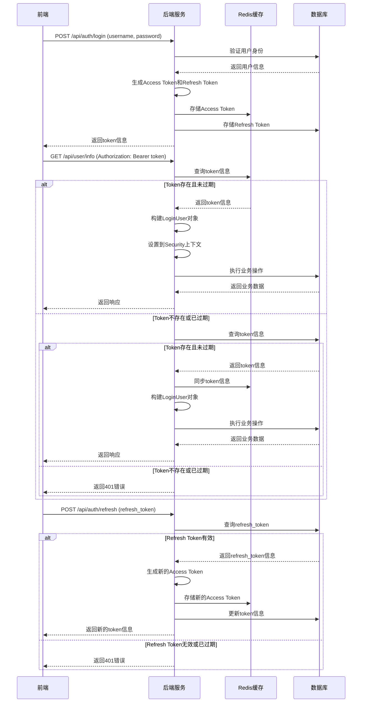

## 1. Token 获取机制
### 1.1 认证流程概述
系统采用 OAuth2.0 认证授权协议，通过以下流程生成和管理令牌：

1. **用户登录**：前端通过用户名密码或其他方式进行身份认证
2. **Token 生成**：后端根据认证结果生成访问令牌（Access Token）和刷新令牌（Refresh Token）
3. **Token 存储**：访问令牌存储在 Redis 中，提高验证效率
4. **Token 使用**：前端在请求头中携带令牌进行身份验证
5. **Token 刷新**：当访问令牌过期时，使用刷新令牌获取新的访问令牌

### 1.2 核心代码实现
#### 1.2.1 Token 生成
**OAuth2TokenServiceImpl.java** 中的 `createAccessToken` 方法负责生成令牌：

```java
@Override
@Transactional
public OAuth2AccessTokenDO createAccessToken(Long userId, Integer userType, String clientId, List<String> scopes) {
    OAuth2ClientDO clientDO = oauth2ClientService.validOAuthClientFromCache(clientId);
    // 创建刷新令牌
    OAuth2RefreshTokenDO refreshTokenDO = createOAuth2RefreshToken(userId, userType, clientDO, scopes);
    // 创建访问令牌
    return createOAuth2AccessToken(refreshTokenDO, clientDO);
}

private OAuth2AccessTokenDO createOAuth2AccessToken(OAuth2RefreshTokenDO refreshTokenDO, OAuth2ClientDO clientDO) {
    OAuth2AccessTokenDO accessTokenDO = new OAuth2AccessTokenDO().setAccessToken(generateAccessToken())
            .setUserId(refreshTokenDO.getUserId()).setUserType(refreshTokenDO.getUserType())
            .setUserInfo(buildUserInfo(refreshTokenDO.getUserId(), refreshTokenDO.getUserType()))
            .setClientId(clientDO.getClientId()).setScopes(refreshTokenDO.getScopes())
            .setRefreshToken(refreshTokenDO.getRefreshToken())
            .setExpiresTime(LocalDateTime.now().plusSeconds(clientDO.getAccessTokenValiditySeconds()));
    accessTokenDO.setTenantId(TenantContextHolder.getTenantId());
    oauth2AccessTokenMapper.insert(accessTokenDO);
    // 记录到 Redis 中
    oauth2AccessTokenRedisDAO.set(accessTokenDO);
    return accessTokenDO;
}

private OAuth2RefreshTokenDO createOAuth2RefreshToken(Long userId, Integer userType, OAuth2ClientDO clientDO, List<String> scopes) {
    OAuth2RefreshTokenDO refreshToken = new OAuth2RefreshTokenDO().setRefreshToken(generateRefreshToken())
            .setUserId(userId).setUserType(userType)
            .setClientId(clientDO.getClientId()).setScopes(scopes)
            .setExpiresTime(LocalDateTime.now().plusSeconds(clientDO.getRefreshTokenValiditySeconds()));
    oauth2RefreshTokenMapper.insert(refreshToken);
    return refreshToken;
}
```

#### 1.2.2 Token 刷新
**OAuth2TokenServiceImpl.java** 中的 `refreshAccessToken` 方法负责刷新令牌：

```java
@Override
public OAuth2AccessTokenDO refreshAccessToken(String refreshToken, String clientId) {
    // 查询访问令牌
    OAuth2RefreshTokenDO refreshTokenDO = oauth2RefreshTokenMapper.selectByRefreshToken(refreshToken);
    if (refreshTokenDO == null) {
        throw exception0(GlobalErrorCodeConstants.BAD_REQUEST.getCode(), "无效的刷新令牌");
    }

    // 校验 Client 匹配
    OAuth2ClientDO clientDO = oauth2ClientService.validOAuthClientFromCache(clientId);
    if (ObjectUtil.notEqual(clientId, refreshTokenDO.getClientId())) {
        throw exception0(GlobalErrorCodeConstants.BAD_REQUEST.getCode(), "刷新令牌的客户端编号不正确");
    }

    // 移除相关的访问令牌
    List<OAuth2AccessTokenDO> accessTokenDOs = oauth2AccessTokenMapper.selectListByRefreshToken(refreshToken);
    if (CollUtil.isNotEmpty(accessTokenDOs)) {
        oauth2AccessTokenMapper.deleteBatchIds(convertSet(accessTokenDOs, OAuth2AccessTokenDO::getId));
        oauth2AccessTokenRedisDAO.deleteList(convertSet(accessTokenDOs, OAuth2AccessTokenDO::getAccessToken));
    }

    // 已过期的情况下，删除刷新令牌
    if (DateUtils.isExpired(refreshTokenDO.getExpiresTime())) {
        oauth2RefreshTokenMapper.deleteById(refreshTokenDO.getId());
        throw exception0(GlobalErrorCodeConstants.UNAUTHORIZED.getCode(), "刷新令牌已过期");
    }

    // 创建访问令牌
    return createOAuth2AccessToken(refreshTokenDO, clientDO);
}
```

### 1.3 refreshTokenValiditySeconds 控制机制
**refreshTokenValiditySeconds** 是 OAuth2 客户端配置中的一个属性，用于控制刷新令牌的有效期：

1. **定义位置**：`OAuth2ClientDO.java` 中的 `refreshTokenValiditySeconds` 字段
2. **使用方式**：在创建刷新令牌时，通过 `LocalDateTime.now().plusSeconds(clientDO.getRefreshTokenValiditySeconds())` 计算过期时间
3. **控制逻辑**：
    - 当刷新令牌过期时，系统会拒绝使用该令牌刷新访问令牌
    - 过期的刷新令牌会被自动删除
    - 刷新令牌的有效期应根据业务需求合理设置，通常比访问令牌长

## 2. 前端如何获取核心认证头
### 2.1 认证头类型
系统支持两种认证头传递方式：

1. **Authorization 头**：前端通过 `Authorization: Bearer {token}` 方式传递访问令牌
2. **login-user 头**：服务间调用时通过该头传递用户信息（前端无法直接获取）

### 2.2 前端获取和使用认证头
#### 2.2.1 Token 获取
前端通过登录接口获取 token：

```javascript
// 登录请求
fetch('/api/auth/login', {
  method: 'POST',
  headers: {
    'Content-Type': 'application/json'
  },
  body: JSON.stringify({ username: 'admin', password: '123456' })
})
.then(response => response.json())
.then(data => {
  // 存储 token
  localStorage.setItem('accessToken', data.access_token);
  localStorage.setItem('refreshToken', data.refresh_token);
});
```

#### 2.2.2 Token 使用
前端在后续请求中携带 token：

```javascript
// 携带 token 的请求
fetch('/api/user/info', {
  headers: {
    'Authorization': 'Bearer ' + localStorage.getItem('accessToken')
  }
})
.then(response => response.json())
.then(data => {
  console.log('User info:', data);
});
```

#### 2.2.3 Token 刷新
当前端检测到 token 过期时，使用刷新令牌获取新 token：

```javascript
// 刷新 token
fetch('/api/auth/refresh', {
  method: 'POST',
  headers: {
    'Content-Type': 'application/json'
  },
  body: JSON.stringify({
    refresh_token: localStorage.getItem('refreshToken'),
    client_id: 'your-client-id'
  })
})
.then(response => response.json())
.then(data => {
  // 更新 token
  localStorage.setItem('accessToken', data.access_token);
});
```

### 2.3 CORS 配置与前端访问
**注意**：系统的 CORS 配置中未暴露 `login-user` 头，且网关会移除该头，因此前端无法直接获取 `login-user` 头。前端应通过 `Authorization` 头进行身份验证。

## 3. Redis 中用户信息的获取方式
### 3.1 Redis 存储机制
系统通过 `OAuth2AccessTokenRedisDAO.java` 将访问令牌存储在 Redis 中：

```java
public void set(OAuth2AccessTokenDO accessTokenDO) {
    String redisKey = formatKey(accessTokenDO.getAccessToken());
    // 清理多余字段，避免缓存
    accessTokenDO.setUpdater(null).setUpdateTime(null).setCreateTime(null).setCreator(null).setDeleted(null);
    long time = LocalDateTimeUtil.between(LocalDateTime.now(), accessTokenDO.getExpiresTime(), ChronoUnit.SECONDS);
    if (time > 0) {
        stringRedisTemplate.opsForValue().set(redisKey, JsonUtils.toJsonString(accessTokenDO), time, TimeUnit.SECONDS);
    }
}

public OAuth2AccessTokenDO get(String accessToken) {
    String redisKey = formatKey(accessToken);
    return JsonUtils.parseObject(stringRedisTemplate.opsForValue().get(redisKey), OAuth2AccessTokenDO.class);
}
```

### 3.2 存储结构
Redis 中存储的 token 信息结构如下：

| 字段名 | 类型 | 描述 |
| --- | --- | --- |
| accessToken | String | 访问令牌 |
| userId | Long | 用户ID |
| userType | Integer | 用户类型 |
| userInfo | Map | 用户附加信息 |
| clientId | String | 客户端ID |
| scopes | List | 授权范围 |
| refreshToken | String | 刷新令牌 |
| expiresTime | LocalDateTime | 过期时间 |
| tenantId | Long | 租户ID |


### 3.3 获取流程
1. **Token 验证**：后端通过 `TokenAuthenticationFilter.java` 中的 `buildLoginUserByToken` 方法验证 token
2. **Redis 查询**：优先从 Redis 中获取 token 信息，提高验证效率
3. **MySQL 回退**：如果 Redis 中不存在，则从 MySQL 中查询并同步到 Redis
4. **用户信息构建**：根据 token 信息构建 `LoginUser` 对象，设置到 Spring Security 上下文

```java
private LoginUser buildLoginUserByToken(String token, Integer userType) {
    try {
        // 校验访问令牌
        OAuth2AccessTokenCheckRespDTO accessToken = oauth2TokenApi.checkAccessToken(token).getCheckedData();
        if (accessToken == null) {
            return null;
        }
        // 用户类型校验
        List<Integer> userTypeList = Arrays.stream(UserTypeEnum.values()).map(UserTypeEnum::getValue).collect(Collectors.toList());
        if (userType != null && !userTypeList.contains(accessToken.getUserType())) {
            throw new AccessDeniedException("错误的用户类型");
        }
        // 构建登录用户
        return new LoginUser().setId(accessToken.getUserId()).setUserType(accessToken.getUserType())
                .setInfo(accessToken.getUserInfo())
                .setTenantId(accessToken.getTenantId()).setScopes(accessToken.getScopes())
                .setExpiresTime(accessToken.getExpiresTime());
    } catch (ServiceException serviceException) {
        // 校验 Token 不通过时，返回 null
        return null;
    }
}
```

## 4. 认证流程图


## 5. 最佳实践
### 5.1 前端实践
1. **Token 存储**：使用 localStorage 或 sessionStorage 存储 token
2. **Token 管理**：实现 token 过期检测和自动刷新机制
3. **请求拦截**：使用 axios 拦截器统一处理 token 携带
4. **错误处理**：处理 401 错误，引导用户重新登录

### 5.2 后端实践
1. **Token 配置**：合理设置 accessTokenValiditySeconds 和 refreshTokenValiditySeconds
2. **Redis 优化**：配置合适的 Redis 缓存策略，提高验证效率
3. **安全防护**：实现 token 泄露检测和自动失效机制
4. **监控告警**：监控 token 使用情况，及时发现异常

## 6. 常见问题与解决方案
### 6.1 Token 过期问题
**症状**：前端请求返回 401 错误

**解决方案**：

1. 实现 token 自动刷新机制
2. 当 refresh token 也过期时，引导用户重新登录

### 6.2 前端无法获取 login-user 头
**原因**：CORS 配置中未暴露该头，且网关会移除该头

**解决方案**：前端应使用 Authorization 头进行身份验证

### 6.3 Redis 缓存问题
**症状**：token 验证缓慢或失败

**解决方案**：

1. 检查 Redis 连接状态
2. 确保 token 正确同步到 Redis
3. 配置合适的 Redis 过期策略

### 6.4 用户身份确认
**后端确认方式**：

1. 优先通过 Authorization 头中的 Bearer token 确认用户身份
2. 服务间调用通过 login-user 头确认用户身份
3. 结合 Redis 缓存提高验证效率

---

**总结**：本系统采用 OAuth2.0 认证授权协议，通过 Redis 缓存优化验证效率，为前端提供安全、高效的身份认证机制。前端通过 Authorization 头携带访问令牌进行身份验证，后端通过多级缓存和验证机制确保认证安全可靠。

